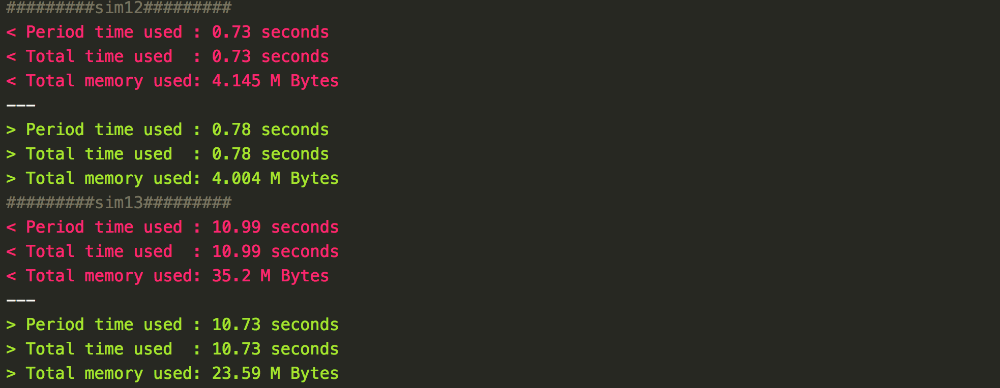
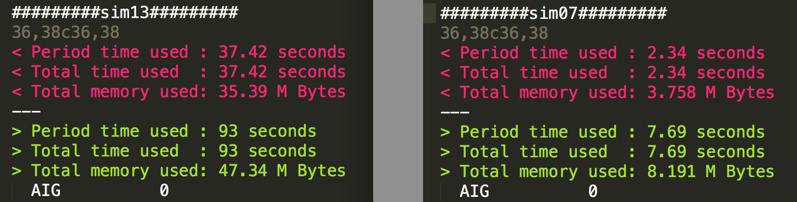

# FRAIGs
> FRAIGs: A Unifying Representation for Logic Synthesis and Verification

1. [Original Paper](https://people.eecs.berkeley.edu/~alanmi/publications/2005/tech05_fraigs.pdf)
2. Try out [AAG-visualizer](https://github.com/ByronHsu/AAG-Visualizer). Make visualization for And-Inverter Graph simple and fast!

## 程式架構
> 以下會以``CirMgr``、``CirGate``兩個最重要的Class說明我整個程式的主架構
> 基本上我設計架構秉持時著ㄧ個重要的精神
> 1. 不寫重複code，全力把功能相似的動作包成同一個function
> 2. 要access一個值時，全力讓他可以O(1)達成

### CirMgr
```cpp
class CirMgr
{
public:
   // hw6 functiom
   void dfsPostOrder(CirGate*);
   void resetFlag();

private:
   GateList gateList, dfsList;
   vector<size_t> piOrder, poOrder;
   size_t maxIndex;

};
```

#### Member Function
- ``dfsPostOrder`` :
	- 依照postOrder的順序去更新dfsList
- ``resetFlag`` :
	- reset

#### Member Variable
- ``gateList`` : 
	- 存放``CirGate*``的指標，大小為M+O+1，初始化為0
- ``dfsList`` :
	- 存放在``dfsPostOrder``時traverse過的``CirGate* ``
- ``piOrder/poOrder`` :
	- 依照readfile的順序存放pi, po至``vector``中，以利在writeFile時順序仍維持跟原始相同
- ``maxIndex`` :
	- 存放``maxIndex``的值，供write時使用


### CirGate
```cpp
class CirGate
{
public:
   // hw6 function
   // fanout也是做一樣的事，就不一一列出
   void dfsFanin(int,string = "",bool = 0) const;
   void addFanin(CirGate* g, bool inv = false);
   CirGate* getFanin(size_t i) const;
   bool isFaninInv(size_t i) const;
protected: 
   GateList fanin, fanout;
   GateType type;
   string symbol;
   size_t line, id;
   mutable bool flag;
};
```

### Member Function

- ``dfsFanin`` : 
	- 對gate做dfs，print出他的fanin cone
- ``addFanin`` : 
	- 加一個gate到fanin中，把invert與否存放在第一個bit
- ``getFanin`` : 
	- 取得fanin的``CirGate*``
- ``isFaninInv`` :
	-  取得fanin的invert

### Member Variable
- ``fanin fanout`` : 
	- 存放fanin, fanout的``CirGate*``
- ``type, symbol, line, id`` :
	-  存放gate的基本資訊
- ``flag`` :
	-  用來做各種標註

<div style="page-break-after: always;"></div>

## Sweep, Opt and Strash

### ``removeGate``
> Core Utils Function for Gate Removing

```cpp
class CirGate
{
	public:
	// Utils
	void updateFan(FanType,CirGate*,CirGate*);
	void removeGate(int, int);
	
	// USAGE
	removeGate(拿來取代原fanin的fanout的literal ID,
	拿來取代原fanout的fanin的literal ID)
	// call updateFan 去處理接fanin/fanout的事情
	// 附註: 若沒有gate會接到原gate的fanin/fanout上，則literalID傳入-1
};
```

### Sweep
1. 將有在``dfsList``中的gate的flag標示為1
2. 將沒被標示到的gate做```removeGate(-1,-1)```
3. 更新dfsList

### Opt
1. 先分三種狀況
	1. 左方literal = 1 || 右方literal = 1
	2. 左方literal = 0 || 右方literal = 0
	3. 左方literal == 右方literal
2. 將要拿來merge的gate的literalID存到```size_t litSub```
3. 執行``removeGate(litSub,-1)``
4. iterate ``dfsList`` 去刪除UNDEF且unused的gate
5. 更新``dfsList``

### Strash
1. 開一個``unordered_map<size_t, CirGate*> map;``
2. iterate ``dfsList``，把在裡頭的gate的兩個fanin的literal ID排序過後，合成一個``size_t``(將較小的左移32位元)，存到``map``中
3. 若``map[key].count == 1``，則執行``removeGate(lit,-1)``

### 結語
> 1. 透過設計良好的utils function可以讓程式碼變的簡潔易懂，我僅透過一個utils function搭配壹些簡單的判斷式就完成了這三個basic function
> 2. 適當的使用literal ID可以表示是否為invert的優勢，能讓程式碼變得優雅好寫

<div style="page-break-after: always;"></div>

## Simulation

### FecGroup
> 新加入的角色：🌈 FecGroup！
> 裡頭存放隸屬於同個FecGroup的gate literal ID

```c++
class FecGroup
{
  public:
    void removeMember(size_t);
    void setMember(size_t, size_t);
    void pushMember(size_t);
  private:
    IdList member;
};
```
#### Member Function
- ``removeMember``:
	- 將gate從這個group中移除
	- **方法是將他用最後一個取代，且將最後一個pop掉，時間複雜度為O(1)**
- ``setMember``:
	- 將variable ID相同的gate的literal ID重設
	- 例如: 5->!5
- ``pushMember``:
	- 將gate``push_back``進這個group

#### Member Variable
- ``member``:
	- 以``IdList``存放裡面每個gate的literal ID

### CirGate
```cpp
class CirGate
{
public:
   virtual void simulate() = 0;
protected: 
   FecGroup* fecGroup;
   size_t simVal;
```
#### Member Function
- ``simulate``
	- 依照gate的功能不同，更新每個gate的``simVal``
	
#### Member Variable
- ``fecGroup``
	- 存放``*fecGroup``放它可以以O(1)時間access到他的``fecGroup``
- ``simVal``
	- 存放gate output的simulation value

### CirMgr

```cpp
class CirMgr
{
public:
   // simulation
   void sim64(vector<size_t>&, bool = 0);
   void log64(size_t l = 64);
   void initFecList();
   bool removeFecGroup(size_t);
private:
   FecList fecList;
   bool hasSim;
};
```

#### Member Function
- ``sim64``
	- 平行模擬64個bits，傳入一個size為PI個數的``vector<size_t>``，給在dfsList當中的``gate``去做simulation
- ``log64``
	- 以string形式輸出64bits的PO``simValue``
- ``initFecList``
	- 將CONST和所有在``dfsList``中的AIG放入一個fecGroup，並``push``進``fecList``
- ``removeFecGroup``
	- 將個數為0或1的``fecGroup``從fecList中移除

#### Member Variable
- ``fecList``:
	- 型態為``vector<*FecGroup>``
	- 存放``FecGroup``的指標
- ``hasSim``
	- 判斷是否有simulation過 

### Algorithm
> 主要的演算法執行在``sim64``，``randomSim``、``fileSim``僅是將pattern處理過後傳入``sim64``中執行，因此以下僅介紹如何實作sim64

0. 前置作業(在random/fileSim中)
	1. 若``!hasSim``，call ``initFecList``將所有的gate加到同一個``*fecGroup``中
1. 用input去simulate circuit
	1. 先將input存入pi當中
	2. 依照``dfsList``順序去做simulation
		
	```c++
	  for(size_t i = 0; i < piOrder.size(); i++)
	    gateList[piOrder[i]]->simVal = input[i];
	    
	  for(size_t i = 0; i < dfsList.size(); i++)
	    dfsList[i]->simulate();
	```

2. 處理``fecGroup``
	1. iterate ``fecList`` ，對於當中的每個``fecGroup``產生一個``HashMap``去檢查``simVal``是否有對應的``*fecGroup``
	2. iterate ``fecGroup->member``
		1. **若**他是當中的第一個gate，強迫致使他留在原始的group
		2. **若**``map.count(simVal)``
			1. **若**``map[simVal]``等於原始的group，call``fecGroup->setMember``去更新那個index中的值(因為可能正反會不同, 例如!5->5)
			2. **若**``map[simVal]``不等於原始的group，先call``fecGroup->removeMember``將他從原始的``fecGroup``中刪除，再call``fecGroup->pushMember``將他**正**的literal ID，push到新的``fecGroup``中
		3. **若**``map.count(~simVal)``則執行類似2的動作，只是將**正**改為**反**
		4. **若**都不符合上述兩種情況，則開創一個新的``fecGroup``並把它將到裡頭
	3. 如果這個``fecGroup``分完後，裡面只剩一個member，則可以將它從刪除(**重要 大大提升效率**)
		
	```c++
	  for(size_t i = 0; i < fecList.size();){ 
	    unordered_map<size_t, FecGroup*> map;
	    for(size_t j = 0; j < fecList[i]->member.size();){
	      //讓第一個留在原group
	      if(j == 0){...}
	      if(map.count(simVal)){...}
	      else
	      if(map.count(~simVal)){...}
	      else{...}
	    }
	    //如果它的大小是1，砍掉，continue
	    if(removeFecGroup(i)){continue;}
	  }
	```
	
<div style="page-break-after: always;"></div>

### Performance Compare


#### 測試
- dofile(generated by my **FRAIG TESTING ENGINE**)

```
cirr ./tests.fraig/simxx.aag
cirsim -f tests.fraig/pattern.xx -o xx.log
cirp -fec
cirg *
```
#### 分析
> 除了sim12, sim13以外，period time幾乎都趨近零秒，所以僅拿這兩個來做效能分析
> 紅色為my program，綠色為ref program

在數次的優化後，效能終於和ref program相近，我認為其中最重要的兩項優化為
1. 將``erase``改為hw5中``remove``的做法，O(n)->O(1)
2. 將數量僅剩一個的``fecGroup``刪除，若不刪除的話，需要花時間產生大量無意義的``unordered_map``，runtime會數倍之多

<div style="page-break-after: always;"></div>

## Fraig
> 在這個部分，因為演算法較為複雜，直接介紹class裡頭多加了哪些member可能會讓讀者看得一頭霧水，所以我決定先解析我在設計這套演算法時的思路，再說明要使用這套演算法時，需要多加入哪些member

### Algorithm

#### 笨方法
> 單打獨鬥下的結果

**要做fraig，最直覺的方法是什麼？**
先吃盡整張圖後，將所有的``fecGroup``利用``SAT ENGINE``一一證明，若證出不一樣便將使其不一樣的``pattern``丟入``sim``，把``fecGroup``拆群，這樣一來，最終留在同一個group的即為可相互合併的gate，挑選出其中id最小的gate，使用``removeGate``以他為基準去合併別人

**這樣會有什麼問題**
1. 會莫名``segmentation fault``
2. 效率奇差，``sim12``要跑``80s``、``sim13``沒有跑完過...

**WHY？**
1. 經過 *林承德* 大神的精闢解析後，我意識到gate是不能亂merge的，否則可能會產生cycle，因此會導致``segmentation fault``，最安全的方法是把dfsOrder順序在最前面的gate當作base去merge別人
2. 經過 *歐瀚墨* 大神的開示後，我理解到SAT的時間複雜度和``吃進去的圖``呈正相關，一次吃進去整張圖，當然會使程式慢的跟蝸牛一樣

#### 🔥🔥HOCL Algorithm🔥🔥
> designed by Byron **H**su, Hanmo **O**u, Perry **C**hen, Jerry **L**in

**終極目標**
使每次吃進去的圖最小化！
	
**思路**

1. 若想使吃進``solver``的圖變小，最簡單的做法就是在prove兩個gate的時候，不要吃進整張圖，而是只吃入他們``fanin cone``的聯集
	*但我每次都一定得吃入原圖中的``fanin cone``嗎？*
	**不，我可以在每次merge過後更新他的圖再把變小的圖吃進去，**
	但怎樣才可以讓每個gate平均吃到的gate最少呢？
	讓gate**按照postOrder**順序去被merge！利用postOrder的特性，這樣一來在父親被merged時，小孩已經被merge過了，代表他的``fanin cone``會越縮越小🚀（**速度的關鍵**)

2. 還可以做什麼優化？
	在gate已經被merge過後，把沒有在新的``dfsList``當中所出現的gate從``fecGroup``刪除，這樣一來可以減少**非常多**無謂的``SAT PROVE``✈️（**加速的關鍵**)！因為最終那些gate都會在``sweep``時被去除掉

### 如何實作？
>  Base：fecGroup中拿來merge別人的gate，為fecGroup中dfsOrder順序最前面者

#### 流程
1. 在``cirfraig``前先更新一次每個``fecGroup``中的base
2. 開始iterate``dfsList``，如果找到``AIG``且他的``fecGroup``不為``NULL``則
	1. **若**他的``base``等於他自己，則直接continue，因為他不可能被merge
	2. 跑dfs將兩個他與他的``base``的``fanin``聯集存到``coneList``中
	3. 將``coneList``丟入``genProofModel``
	4. **若** ``SAT``
		- 把``pattern``丟入sim64將其拆開
	5. **若** ``UNSAT``
		1. 將它從他的``fecGroup``中拔除
		2. **若**刪完後他的原``fecGroup``的大小變為0或1，則把它從``fecList``中拔除
		3. call ``removeGate``去做merge gate
		4. ``updateFraigDfs``，如果不``updateDfs``的話，跑sim的時候最會炸掉，因為sim是仰賴於``dfsList``，如果不更新的話，會跑到已經被``delete``掉的gate.
		5. 對每個``fecGroup``做``setBase``和``removeFecGroup``，``setBase``時先將不在``dfsList``當中gate移除，再找出當中``dfsOrder``最前面的當作``base``，``removeFecGroup``則是把更新過後大小變為0或1的``fecGroup``從``fecList``移除
		6. 從新的``dfsList``的頭開始跑

<div style="page-break-after: always;"></div>

> 在class中新增添的member

### FecGroup

```c++
class FecGroup
{
  public:
    void setBase();
  private:
    size_t baseIdx;
};
```
#### Member Function
- ``setBase``
	- 把沒在``dfsList``中的gate移除
	- 藉由``dOrder``更新``baseIdx``

#### Member Variable
- ``baseIdx``
	- 儲存base在``fecGroup``中的哪個``index``

### CirGate
```cpp
class CirGate
{
public:
   void setVar(size_t& v);
   size_t getVar();
protected: 
   size_t fIdx, var;
   int dOrder;
};
```
#### Member Function
- ``setVar getVar``
	- 設置，取得在``solver``中的``Var``

#### Member Variable
- ``fIdx`` 
	- 儲存這個gate在他的``fecGroup``當中的``index``，會在``removeMember``等等函式去做動態的更新
	- 為了使每個``gate``被merge時，我可以以O(1)時間得知他在``fecGroup``的何處並快速刪除
- ``dOrder``
	- 存放每個gate在``dfsList``當中的``order``，會在``updateFraigDfs``去做動態的更新
	
### CirMgr

```cpp
class CirMgr
{
public:
   void genProofModel(GateList&);
   bool isSAT(size_t,size_t,vector<size_t>&,GateList&);
   void updateDfsFraig();
   void findFaninCone(CirGate*,GateList&);
private:
   bool hasFraig;
};
```

#### Member Function
- ``genProofModel``
	- 傳入``coneList``讓他建圖
- ``isSAT``
	- 判斷兩個gate``SAT``
- ``updateDfsFraig``
	- merge後更新``dfsList``和``dOrder``
- ``findFaninCone``
	- 讓gate跑遞迴，把fanin存到``ConeList``中

#### Member Variable
- ``hasFraig``
	- 判斷是否有做過``cirfraig``，如果有，我就直接在``cirFraig``中把他擋掉
	- 因為我的程式能保證一次畫到最簡

### Performance Compare

> 紅色為my program、綠色為ref program

#### 測試
- dofile(generated by my **FRAIG TESTING ENGINE**)

```c++=
cirr ./tests.fraig/xx.aag
// 直接做cirfraig以精準測試cirfraig的效能(cirstrash ciropt都有可能是他的子集合)
// iterate 3 times
cirsim -r
cirfraig...
// print fec to ensure fecList is empty after fraig
cirp -fec
// 做三種化簡以確保他化至最簡
cirsw
ciropt
cirstrash
cirp
// 印出他的summary比對aig個數、不印其他的因為最後結構可能長的不同
usage
q -f
// 最後再透過ref的miter驗證他們是否相等

```
### 分析
> 僅花ref-program
> ✈️🚀三分之一🚀✈️
> 左右的時間就把cirFraig跑完，記憶體用量也較ref program少
> 且最後有透過`miter`驗證結果正確